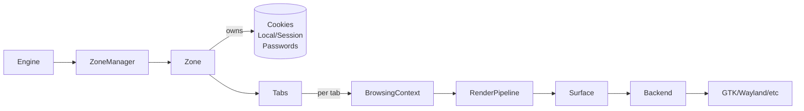

# Gosub – Browser Engine API

> **Status:** early work-in-progress. Interfaces are stabilizing; expect breaking changes.

Gosub is a modular, embeddable browser engine written in Rust. It targets host applications (a full browser UI, 
a webview-style component, or custom tools) via a clean **engine API** and pluggable subsystems (render backends, 
storage, networking, etc.).

This repository sets up a template for the **Gosub API layer** – the boundary that host apps use to embed and drive 
the engine. This design will ultimately be implemented in the main [Gosub Engine repository](https://github.com/gosub-io/gosub-engine).

For now, it provides us a place to experiment with the API, backend abstractions, and storage models without too much 
interference of existing logic.

---

## Highlights

* **Zones** as first‑class isolation units (cookies, local/session storage, password store, etc.).
* **Tabs** managed inside zones; each tab encapsulates a browsing context (DOM/graphics/framebuffer).
* **Pluggable render backends** (Cairo today; Vello/Skia optional via cargo features) behind a single trait.
* **Opt‑in resource fetching** using async Rust (reqwest). Streamed/advanced pipelines coming later.
* **GTK example** showing Cairo compositing into an image surface and painting to screen.

---

## Table of Contents

1. [Concepts](#concepts)
2. [Architecture](#architecture)
3. [Getting Started](#getting-started)
4. [Examples](#examples)
5. [Rendering Backends](#rendering-backends)
6. [Storage](#storage)
7. [Concurrency Model](#concurrency-model)
8. [FFI / Embedding Roadmap](#ffi--embedding-roadmap)
9. [Project Layout](#project-layout)
10. [Feature Flags](#feature-flags)
11. [Contributing](#contributing)
12. [License](#license)

---

## Concepts

### Zone

A **Zone** is an isolation boundary similar to a browser profile or container. It owns storage (cookies, session/local 
storage), password entries, and configuration. Tabs belong to a zone; a host app can keep multiple zones and opt into 
sharing specific resources between zones (e.g., shared password store) with clear ownership rules.

### Tab

A **Tab** encapsulates a running engine instance (document/DOM and rendering state). Tabs can be visible or offscreen. 
Visible tabs own a framebuffer/surface sized to the viewport; hidden tabs typically relinquish GPU/CPU surfaces until 
activated.

### Backend

A **Render Backend** implements a common drawing surface/renderer trait. The engine emits a composited buffer per tab 
viewport; backends adapt that buffer to the host: e.g., Cairo into GTK, Vello into a GPU surface, etc.

---

## Architecture

* **Engine** → manages Zones and top-level orchestration.
* **Zone** → owns storage/services; manages Tabs.
* **Tab** → owns an **BrowsingContext** (DOM, layout, paint), a **Surface** (when visible), and state like title, favicon.
* **Render Pipeline** → produces a composited buffer sized to the tab viewport. Reallocated on resize. (Not avaiable yet)
* **Backend abstraction** → `Backend` trait to create surfaces and drive rendering.



---

## Getting Started

### Requirements

* Rust (stable or nightly; we test nightly regularly).
* GTK 4 dev packages (for the GTK example).

## Examples

A GTK example demonstrates:

* Creating an engine and multiple tabs (split screen potential).
* Using the **Cairo backend** to paint the composited buffer onto a GTK drawing area.
* Reallocating surfaces on resize and re-rendering.

Run it from the repo root:

```bash
cargo run --example gtk --features backend-cairo
```

---

## Rendering Backends

Backends implement a small trait surface:

```rust
pub trait Backend {
    fn create_surface(&self, size: SurfaceSize, present: PresentMode) -> anyhow::Result<Box<dyn ErasedSurface>>;
    fn render(&mut self, ctx: &mut BrowsingContext, surface: &mut dyn ErasedSurface) -> anyhow::Result<()>;
}
```

### Cairo (CPU, GTK-friendly)

* Produces an `ImageSurface` for the active tab viewport.
* Host paints via GTK/Cairo.

### Vello / Skia (GPU)

* Planned: feature-gated crates.
* Same API surface; different `Surface` types and present modes.

---

## Storage

* **Cookies**: Zone-owned cookie jar; pluggable store (e.g., SQLite). Host can swap in its own implementation.
* **Local & Session storage**: trait-based storage areas. In-memory stores provided for testing; SQLite-backed stores available.

---

## FFI / Embedding Roadmap

Although the primary API is Rust, the boundary is being shaped to support FFI for **Python** and **C** hosts:

* Stable C ABI façade over the engine API.
* Opaque handles for Engine/Zone/Tab.
* Zero‑copy or copy‑on‑demand surface export hooks (e.g., read‑only view into the composited buffer or a move‑out into a host‑owned handle).

> For Python, we intend to provide a thin PyO3 layer on top of the C ABI or direct bindings.

---

## Feature Flags

* `backend-cairo` (default in examples): CPU rendering, GTK-friendly.
* `backend-vello` (planned): GPU path via Vello.
* `backend-skia` (planned): GPU path via Skia.

Enable one backend at a time for smaller builds:

```toml
[features]
default = []
backend-cairo = []
backend-vello = []
backend-skia  = []
```

---

## Contributing

We welcome issues and PRs, especially around:

* Backend implementations and surface abstractions.
* Examples (GTK, Wayland, headless tests).
* API ergonomics and documentation (builder patterns for zone creation, etc.).

Please run `cargo fmt`, `cargo clippy`, and include tests where practical.

---

## License

Licensed under the MIT License. See the [LICENSE](LICENSE) file for details.
