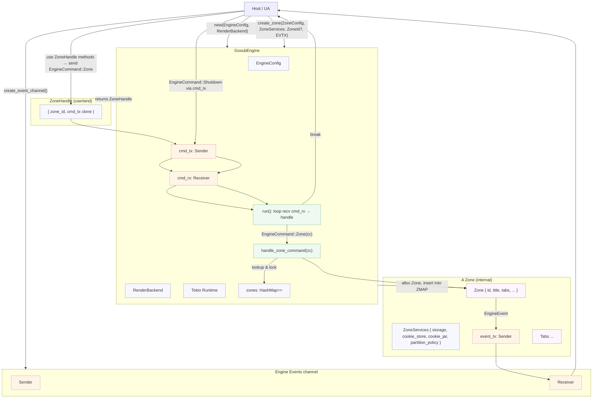

```mermaid

flowchart TD
    UA["Host / UA"]:::ext

    subgraph Engine["GosubEngine"]
        CFG["EngineConfig"]:::data
        BE["RenderBackend"]:::data
        RT["Tokio Runtime"]:::data
        ZMAP["zones: HashMap<ZoneId, Arc<Mutex<Zone>>>"]:::data
        CMDTX["cmd_tx: Sender<EngineCommand>"]:::chan
        CMDRX["cmd_rx: Receiver<EngineCommand>"]:::chan
        RUN["run(): loop recv cmd_rx → handle"]:::code
        HZC["handle_zone_command(zc)"]:::code
    end

    subgraph ZoneSide["A Zone (internal)"]
        Z["Zone { id, title, tabs, ... }"]:::state
        ZS["ZoneServices { storage, cookie_store, cookie_jar, partition_policy }"]:::data
        EVT_TX["event_tx: Sender<EngineEvent>"]:::chan
        TABS["Tabs ..."]:::state
    end

    subgraph Handle["ZoneHandle (userland)"]
        ZH["{ zone_id, cmd_tx clone }"]:::data
    end

    subgraph Events["Engine Events channel"]
        EVTX["Sender<EngineEvent>"]:::chan
        EVRX["Receiver<EngineEvent>"]:::chan
    end

    %% UA bootstraps
    UA -->|"new(EngineConfig, RenderBackend)"| Engine
    UA -->|"create_event_channel()"| Events
%%    Engine -. returns .->|"(EVTX, EVRX)"| UA

    %% Create zone
    UA -->|"create_zone(ZoneConfig, ZoneServices, ZoneId?, EVTX)"| Engine
    Engine -->|alloc Zone, insert into ZMAP| Z
    Engine -->|returns ZoneHandle| Handle

    %% Command flow
    UA -->|use ZoneHandle methods → send EngineCommand::Zone| ZH
    ZH --> CMDTX
    CMDTX --> CMDRX
    CMDRX --> RUN
    RUN -->|"EngineCommand::Zone(zc)"| HZC
    HZC -->|lookup & lock| ZMAP
    HZC --> Z

    %% Zone emits events
    Z -->|EngineEvent| EVT_TX
    EVT_TX --> EVRX
    EVRX --> UA

    %% Shutdown
    UA -->|EngineCommand::Shutdown via cmd_tx| CMDTX
    CMDTX --> CMDRX
    CMDRX --> RUN
    RUN -->|break| UA

    classDef ext fill:#eef,stroke:#88a;
    classDef data fill:#f7f7ff,stroke:#99c;
    classDef chan fill:#fff5e6,stroke:#d9a;
    classDef code fill:#eefaf1,stroke:#7b9;
    classDef state fill:#fef6ff,stroke:#b8a;


```