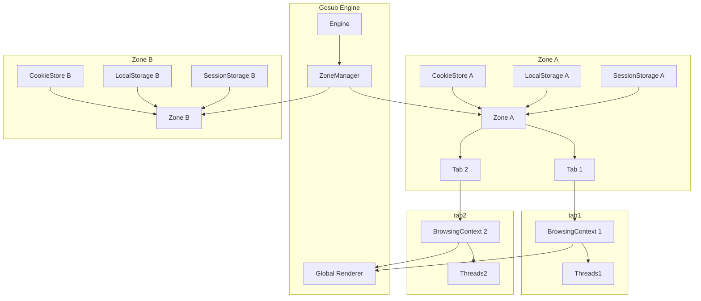

```mermaid
graph TD

    subgraph engine["Gosub Engine"]
        Engine["Engine"] --> ZoneManager["ZoneManager"]
        ProcessRenderer["Global Renderer"]
    end
    
    subgraph za["Zone A"]
        ZoneManager --> ZoneA["Zone A"]
        CookieStoreA["CookieStore A"] --> ZoneA
        LocalStorageA["LocalStorage A"] --> ZoneA
        SessionStorageA["SessionStorage A"] --> ZoneA
        ZoneA --> Tab1["Tab 1"]
        ZoneA --> Tab2["Tab 2"]
    end

    subgraph zb["Zone B"]
        ZoneManager --> ZoneB["Zone B"]
        CookieStoreB["CookieStore B"] --> ZoneB
        LocalStorageB["LocalStorage B"] --> ZoneB
        SessionStorageB["SessionStorage B"] --> ZoneB
    end
    
    subgraph tab1
        Tab1 --> BrowsingContext1["BrowsingContext 1"]
        BrowsingContext1 --> Threads1
        BrowsingContext1 --> ProcessRenderer
    end
    
    subgraph tab2
        Tab2 --> BrowsingContext2["BrowsingContext 2"]
        BrowsingContext2 --> ProcessRenderer
        BrowsingContext2 --> Threads2
    end
    
```