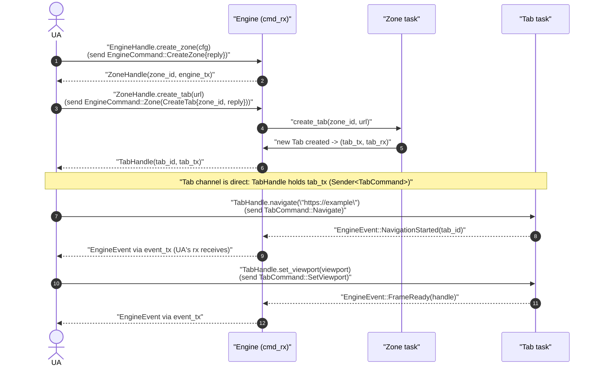
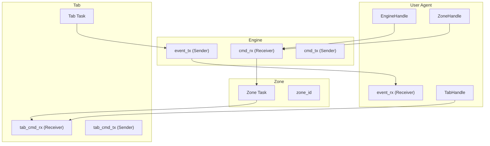

# Current channels


## User agent <-> Engine communication 
    (tx, rx) = engine.create_event_channel()

The `tx` will be passed to the `create_zone()`, so a zone can use this to send events back to the UA.
The `rx` part will stay with the UA and will be used to receive events from the engine, zones and all tabs.

## ZoneHandle
The `ZoneHandle` holds a `cmd_tx`. This is a transmit (tx) where you can send `EngineCommands` to the engine. These 
commands will be received (rx) by the engine's run() loop.

 - If the command is an `EngineCommand`, it will control things on the engine (shutdown, some runtime settings)
 - If the command is a `ZoneCommand`, it will control zone things (create/close zone, list zones, set zone properties)
 - If the command is a `TabCommand`, it will be ignored (maybe give a `EngineError::IncorrectCommand` or something)

The `ZoneHandle` itself holds some functions to make it easier to communicate with the engine:

```rust
impl ZoneHandle {
    pub async fn set_color(&self, color: [u8; 4]) -> Result<()> {
        let (tx, rx) = oneshot::channel();
        self.cmd_tx.send(EngineCommand::Zone(ZoneCommand::SetColor {
            zone_id: self.zone_id,
            color,
            reply: tx,
        })).await?;
        rx.await?
    }
}
```

Questions:
- Why are we sending engine commands to a "ZoneHandle"? Shouldn't we do this on an "EngineHandle"?


## TabHandle
The `TabHandle` holds a `tab_cmd_tx`. This is a transmit (tx) where you can send `TabCommands` to the tab. These
commands will be received (rx) by the tab's own thread/task that is running in the background.
    





